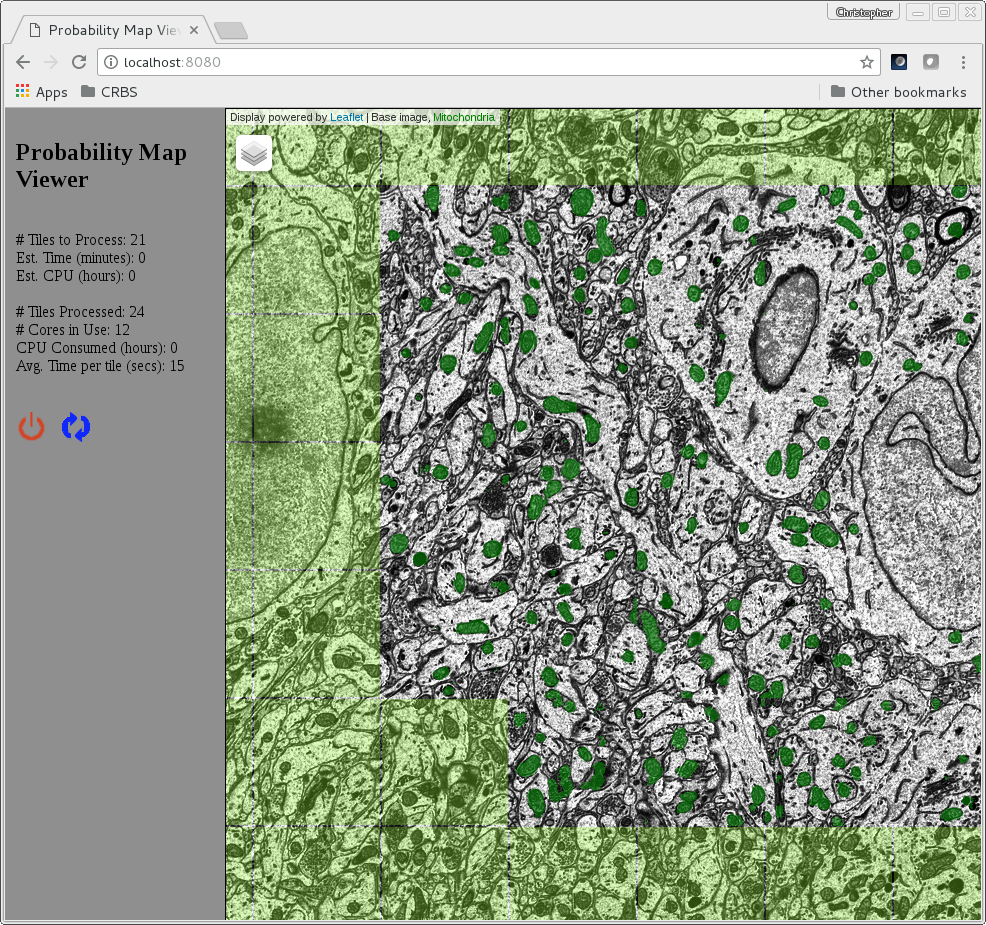

[chm]: http://www.sci.utah.edu/software/chm.html
[imagemagick]: http://www.imagemagick.org/
[matlabruntime]: http://www.mathworks.com/products/compiler/mcr/
[jetty]: http://eclipse.org/jetty/
[maven]: http://maven.apache.org/
[java]: https://www.oracle.com/java/index.html
[git]: https://git-scm.com/
[chmutil]: https://github.com/crbs/chmutil
[imod]: http://bio3d.colorado.edu/imod

Probability Map Viewer
======================

Formerly known as  **Segmenter**

[](https://travis-ci.org/CRBS/probabilitymapviewer) [](https://coveralls.io/github/CRBS/probabilitymapviewer?branch=master)

Probability Map Viewer is a web application using an embedded [Jetty][jetty] web server that 
performs probability map generation in near real time on tiled image data. 
Probability Map Viewer is designed to be run on a linux machine with the web application
viewable locally or remotely via a web browser.

Probability map generation can be performed by an external command line script.

**Publication**

Churas,C. et al. (2017) Probability Map Viewer: near real-time probability map generator of serial block electron microscopy collections. Bioinformatics, 33, 3145–3147.




Probability Map Viewer supports two modes, a single image analysis mode and collection mode. 
In collection mode Probability Map Viewer automatically switches to the latest image that 
appears in a user specified directory.


Requirements
============

* Centos 6+, Ubuntu 12+, and most other linux distributions should work
* [Java][java] 8+ **(jdk to build)**
* [Image Magick][imagemagick] command line programs (namely **convert**)
* [Matlab Runtime 2013a][matlabruntime] (needed to run [CHM][chm])
* [Maven][maven] 3.0 or higher **(to build)**
* [chmutil][chmutil] (used when probabilitymapviewer is converting dm4 files via **--dm4collectionmode**)
* [IMOD][imod] (used to convert dm4 files via **--dm4collectionmode**)


Running 
=======

A pre-built jar is available here: https://github.com/crbs/probabilitymapviewer/releases

Probability Map Viewer is started via the command line.  

For usage instructions run the following command 
(assuming the jar file is in the current working directory):

```Bash
java -jar probabilitymapviewer-<VERSION>-jar-with-dependencies.jar -h
```

**\<VERSION\>** will be the version of the Probability Map Viewer.

For more information visit the wiki:

### https://github.com/crbs/probabilitymapviewer/wiki


Building Probability Map Viewer manually  
===========================

Probability Map Viewer build requirements:

* [Java 8+][java] JDK
* [Maven][maven] 3.0 or higher **(to build)**

Commands build Probability Map Viewer assuming machine has [Git][git] command line tools 
installed:

```Bash
# In lieu of git one can just download repo and unzip it
git clone https://github.com/crbs/probabilitymapviewer.git

cd probabilitymapviewer
mvn clean test install
```

The above command will create a jar file under **target/** named 
**probabilitymapviewer-\<VERSION\>-jar-with-dependencies.jar**


COPYRIGHT AND LICENSE
=====================

For [CHM][chm] see license [here][CHM]
  
Copyright 2016 The Regents of the University of California All Rights Reserved

Permission to copy, modify and distribute any part of this Probability Map Viewer for 
educational, research and non-profit purposes, without fee, and without a 
written agreement is hereby granted, provided that the above copyright notice, 
this paragraph and the following three paragraphs appear in all copies.

Those desiring to incorporate this Probability Map Viewer into commercial products
or use for commercial purposes should contact the Technology Transfer Office, 
University of California, San Diego, 9500 Gilman Drive, Mail Code 0910, 
La Jolla, CA 92093-0910, Ph: (858) 534-5815, FAX: (858) 534-7345, 
E-MAIL:invent@ucsd.edu.

IN NO EVENT SHALL THE UNIVERSITY OF CALIFORNIA BE LIABLE TO ANY PARTY FOR 
DIRECT, INDIRECT, SPECIAL, INCIDENTAL, OR CONSEQUENTIAL DAMAGES, INCLUDING 
LOST PROFITS, ARISING OUT OF THE USE OF THIS Probability Map Viewer, EVEN IF THE UNIVERSITY 
OF CALIFORNIA HAS BEEN ADVISED OF THE POSSIBILITY OF SUCH DAMAGE.

THE Probability Map Viewer PROVIDED HEREIN IS ON AN "AS IS" BASIS, AND THE UNIVERSITY 
OF CALIFORNIA HAS NO OBLIGATION TO PROVIDE MAINTENANCE, SUPPORT, UPDATES, 
ENHANCEMENTS, OR MODIFICATIONS. THE UNIVERSITY OF CALIFORNIA MAKES NO 
REPRESENTATIONS AND EXTENDS NO WARRANTIES OF ANY KIND, EITHER IMPLIED OR 
EXPRESS, INCLUDING, BUT NOT LIMITED TO, THE IMPLIED WARRANTIES OF 
MERCHANTABILITY OR FITNESS FOR A PARTICULAR PURPOSE, OR THAT THE USE OF 
THE Probability Map Viewer WILL NOT INFRINGE ANY PATENT, TRADEMARK OR OTHER RIGHTS. 
